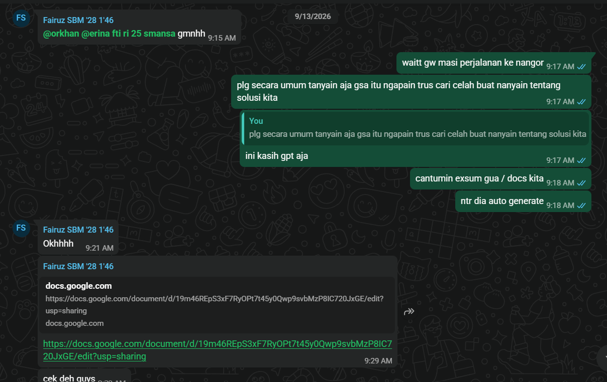

## Kompetensi target

Membedakan person, personality, dan character serta memilih objective, repertoire, dan language yang sesuai.

## Evidence wajib

- Lima character dari sedikitnya tiga domain kehidupan.
- Objective, responsibility, repertoire, dan risiko tiap character.
- Satu contoh perubahan language ketika character berubah.

::: {.callout-tip title="Lihat contoh pengisian"}
[Buka contoh fiktif Minggu 1](../examples/week-01.qmd) untuk melihat tingkat kekonkretan evidence dan analisis. Jangan menyalin contoh sebagai evidence pribadi.
:::

## Lima Character - Peta Karakter Komunikasi Pribadi

| Domain dan Character | Person & Relationship | Objective & Responsibility | Repertoire & Language | Risiko dan Latihan |
|---|---|---|---|---|
| **Diri - Pengatur Diri saat Belajar** | Diri sendiri ketika dihadapkan pada tugas akademik | **Objective:** Mencegah penundaan tugas dan menjaga konsistensi belajar. **Responsibility:** Mengelola motivasi dan disiplin pribadi. | Self-talk yang santai namun tegas; membuat catatan pengingat di WhatsApp (personal chat) sebagai daftar tugas harian. | Berisiko lalai dan menunda pekerjaan karena kecenderungan prokrastinasi meski memiliki kapabilitas. **Latihan:** Menetapkan batas waktu tegas (time-boxing) dan meninjau catatan setiap malam. |
| **Keluarga - Kakak Pertama** | Orang tua dan adik di kampung halaman (komunikasi jarak jauh karena merantau) | **Objective:** Memenuhi arahan orang tua dan mengayomi adik. **Responsibility:** Menyampaikan perkembangan perkuliahan secara terbuka dan membantu adik ketika mengalami kesulitan. | Bahasa semi-formal, empatik, dan teratur melalui WhatsApp; menyampaikan kabar secara berkala dan menawarkan bantuan secara proaktif. | Komunikasi dapat merenggang akibat jarak. **Latihan:** Menjadwalkan panggilan rutin dan memastikan pesan tersampaikan dengan jelas tanpa asumsi. |
| **Teman - Sahabat Dekat** | Teman dekat di lingkungan perkuliahan | **Objective:** Menjadi sosok yang dapat diandalkan dan membangun relasi jangka panjang. **Responsibility:** Menjaga kepercayaan dan kehadiran emosional dalam pertemanan. | Mendengarkan secara aktif, memahami perspektif teman, dan memberikan bantuan ketika dibutuhkan; bahasa yang hangat, jujur, dan suportif. | Berisiko menjadi pendengar pasif tanpa tindak lanjut. **Latihan:** Melakukan paraphrase dan validasi sebelum memberikan saran. |
| **Profesional/Akademik - Anggota Kelompok Tugas** | Rekan satu kelompok mata kuliah | **Objective:** Mencapai tujuan bersama, yaitu penyelesaian tugas dengan hasil dan nilai yang optimal. **Responsibility:** Melaksanakan pembagian tugas (jobdesk) sesuai kesepakatan. | Bahasa yang jelas, terstruktur, dan komitmen pada tenggat; mengerjakan jobdesk dengan sungguh-sungguh serta melakukan konfirmasi tertulis. | Tugas berisiko tidak selesai dan nilai kurang optimal jika koordinasi lemah. **Latihan:** Melakukan check-in progres harian dan dokumentasi pembagian kerja. |
| **Komunitas - Anggota Kepanitiaan** | Rekan panitia dalam sebuah acara/kegiatan | **Objective:** Menyukseskan acara sesuai target bersama. **Responsibility:** Menjalin komunikasi antarpanitia dan bekerja sama dalam menjalankan jobdesk. | Bahasa profesional yang tetap santai dan kekeluargaan; mengedepankan kolaborasi, musyawarah, dan saling menghargai peran. | Acara dapat berjalan tidak lancar akibat miskomunikasi. **Latihan:** Menggunakan forum koordinasi yang jelas (grup kerja, briefing singkat) dan menyampaikan update secara berkala. |

## Perubahan Language ketika Character Berbeda

Tujuan yang sama jika disampaikan dari character yang berbeda akan menuntut language yang berbeda, meski nilai inti tetap sama.

**Sebagai Teman Dekat:** "Gimana kalau ceritain dulu aja pelan pelan, aku dengerin. Mau didengerin aja atau kita cari solusi bareng?"

**Sebagai Anggota Kelompok Tugas:** "Tim butuh kepastian progres sebelum jam 15.00. Opsi A kita bagi ulang, opsi B kita perpendek scope, mana yang paling realistis buat kamu?"

Nilai kepedulian tetap ada pada keduanya. Sebagai teman, language lebih hangat dan memberi ruang. Sebagai anggota kelompok, language lebih terstruktur dan berorientasi pada tenggat dan opsi yang konkret.

## Konteks Performance

**Tanggal dan setting:** 13 September 2026, diskusi persiapan lomba via chat WhatsApp.

**Persons dan relationship:** N, rekan lomba, relasi sudah dekat dan sering berkolaborasi.

**Objective dan initial state:** State awal, kami belum mengetahui pertanyaan apa yang perlu diajukan untuk interview Google Student Ambassador sebagai kebutuhan data lomba. Objective saya adalah membantu merumuskan pertanyaan tersebut dengan melayout pain points yang perlu ditanyakan, lalu menggunakan bantuan AI untuk mengelaborasikannya. State akhir, pertanyaan interview terumuskan dengan baik dan siap digunakan.

## Evidence

::: {.evidence-block}
Berikut adalah bukti chat WhatsApp saat saya membantu melayout pain points dan merumuskan pertanyaan interview bersama N. Kontribusi saya adalah menyusun daftar pain points, memberi saran perumusan, dan mengelaborasikan daftar tersebut dengan bantuan AI sebelum N merangkumnya di Google Docs.

:::

## Analisis Komunikasi

| Elemen | Evidence dan Analisis |
|---|---|
| Person dan character | Saya hadir sebagai teman dalam konteks tugas kelompok lomba. N sebagai person yang sedang kebingungan merumuskan pertanyaan interview. Character yang saya ambil adalah teman yang suportif namun tetap berorientasi pada tugas. |
| Objective dan state | State awal, kebingungan tentang isi pertanyaan interview. State tujuan, pertanyaan terumuskan dengan baik. Objective tercapai karena daftar pertanyaan berhasil disusun dan dirangkum di Docs. |
| Repertoire dan language | Repertoire utama adalah memberi saran dan mengelaborasi ide. Language yang saya gunakan semi autoritatif, santai tapi terkesan semi formal, dengan nada imperatif yang mengarahkan. Contoh, melayout pain points lalu mengarahkan untuk dielaborasi. |
| Response dan adaptation | Respons N baik, ia menjadi mengerti dan menyampaikan terima kasih atas saran yang diberikan. Karena respons positif, saya tidak perlu melakukan adaptasi besar dan melanjutkan untuk mengelaborasi dengan AI. |
| Agreement dan action | Kesepakatan, saya menyusun pain points dan mengelaborasi dengan AI, kemudian N merangkum hasil elaborasi tersebut di Google Docs sebagai daftar pertanyaan final untuk interview. |
| Relationship outcome | Relasi membaik dan tetap terjaga dengan baik. Kolaborasi berjalan lancar dan saling mendukung untuk persiapan lomba selanjutnya. |

## Penggunaan AI

Menggunakan Opencode untuk merangkum dan membuat list apa saja yang harus dikerjakan terkait perumusan pertanyaan interview. Prompt yang digunakan berisi pain points awal yang saya layout, dengan instruksi untuk mengelaborasi menjadi daftar pertanyaan yang terstruktur. Bagian output yang digunakan adalah struktur pertanyaan yang dielaborasi, yang kemudian saya saring dan sesuaikan sebelum diberikan kepada N. Saya memeriksa akurasi dengan memastikan pertanyaan relevan dengan kebutuhan data lomba, menjaga privacy dengan tidak memasukkan data pribadi N, dan tetap memastikan authority dari pertanyaan tetap berasal dari kebutuhan tim. Pembelajaran yang tetap saya lakukan sebagai manusia adalah kemampuan melayout pain points dan menilai relevansi pertanyaan secara kontekstual.

## Feedback dan Tindak Lanjut

**Feedback yang diterima:** "Ya udah oke sih kayak gitu mah" dari M.A.

**Adaptation atau replay:** Tidak ada perubahan besar yang dilakukan karena feedback menyatakan hasil sudah oke. Saya mempertahankan pendekatan melayout pain points terlebih dahulu sebelum mengelaborasi.

**Next practice:** Saat teman sedang bercerita, saya akan menahan diri untuk tidak langsung memotong atau memberi solusi selama beberapa saat. Saya akan merangkum maknanya dan memvalidasi perasaannya terlebih dahulu, lalu menahan diri sekitar 5 detik sebelum memberikan saran.

## Self-assessment

| Dimensi | Skor 1 sampai 4 | Evidence Singkat |
|---|---:|---|
| Person dan Character | 3 | Character sebagai teman dalam tugas lomba dipetakan dengan jelas, person N dan relasi dekat dijelaskan tanpa mereduksi menjadi label. |
| Objective dan State | 3 | State awal kebingungan dan state tujuan pertanyaan terumuskan dijelaskan eksplisit, evidence perubahan dari belum tahu menjadi daftar pertanyaan final. |
| Repertoire, Language dan AI | 3 | Repertoire memberi saran dan mengelaborasi terlihat, language semi autoritatif sesuai character, penggunaan AI dijelaskan dengan prompt dan pemeriksaan akurasi serta privacy. |
| Response dan Adaptation | 3 | Respons positif N berupa pemahaman dan terima kasih dicatat, adaptasi minimal karena respons sudah mendukung, tetap ada pemantauan. |
| Agreement, Action dan Relationship | 3 | Agreement berupa pembagian kerja, saya melayout dan mengelaborasi, N merangkum di Docs, dampak relasi membaik tercatat. |

**Total: 15/20**

::: {.assessor-only}
### Assessment Dosen

**Skor:** - / 20  
**Evidence yang mendukung:** -  
**Prioritas perbaikan:** -  
**Keputusan:** Belum dinilai / Perlu revisi / Tercapai
:::
