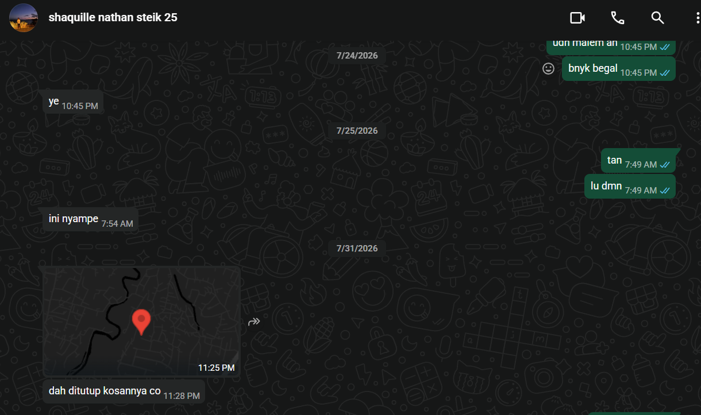

## Kompetensi target

Memisahkan event, fact, story, emotion, internal character, choice, dan action.

## Evidence wajib

- Satu episode komunikasi dengan diri sendiri.
- Initial story dan sedikitnya dua alternative narratives.
- Internal agreement dan bukti tindakan berikutnya.

::: {.callout-tip title="Lihat contoh pengisian"}
[Buka contoh fiktif Minggu 2](../examples/week-02.qmd) untuk melihat tingkat kekonkretan evidence dan analisis. Jangan menyalin contoh sebagai evidence pribadi.
:::

## Episode Intra-Self

**Event:** Teman saya kehilangan kunci kos temannya sehingga harus menginap di kamar saya. Kejadian pada malam hari ketika saya sudah merasa lelah dan ingin beristirahat.

| Lapisan | Catatan |
|---|---|
| Fact | Teman kehilangan kunci kamar kos temannya. Ia meminta izin menginap di kamar saya. Saya dalam kondisi lelah dan ingin tidur. Belum ada keputusan apakah saya akan menolak atau menerima. |
| Initial story | "Saya akan terganggu, kamar jadi tidak nyaman, dan teman saya merepotkan." |
| Emotion dan body signal | Jengkel, rasa tidak nyaman, ingin segera tidur dan menolak kehadiran teman |
| Reactive character | Teman yang menolak, ingin menjaga kenyamanan pribadi dengan tidak memberi tempat |
| Desired character | Teman yang mengayomi, tetap menjaga relasi pertemanan dengan mempersilakan dan membantu |

Initial story melampaui fakta. Fakta hanya kehilangan kunci dan permintaan menginap, bukan penilaian bahwa teman merepotkan atau sengaja mengganggu.

## Alternative Narratives

1. **Kondisi lelah bersama:** Teman juga lelah dan kehilangan kunci bukan kesengajaan. Memberi tempat menginap adalah bentuk saling membantu di saat sulit, bukan beban tambahan.
2. **Cerita malas yang tidak berdasar:** Pikiran bahwa teman malas mencari kunci adalah asumsi. Faktanya ia kehilangan kunci dan belum sempat mencarinya kembali. Menilai malas hanya menambah emosi negatif tanpa evidence.
3. **Opportunity untuk merawat relasi:** Menerima teman menginap semalam dapat memperkuat kepercayaan dan kedekatan, sesuai dengan objective saya sebagai teman yang dapat diandalkan.

Alternative pertama paling berguna karena sesuai fakta, mengurangi emosi jengkel, dan menghasilkan tindakan yang selaras dengan nilai pertemanan.

## Internal Conversation dan Agreement

> **Reactive character:** "Tolak saja, saya capek dan butuh ruang sendiri malam ini."
> **Desired character:** "Kondisi teman juga sulit, kehilangan kunci bukan keinginannya. Saya bisa bantu semalam tanpa mengorbankan istirahat terlalu banyak."
> **Saya:** "Saya akan mempersilakan teman menginap malam ini, lalu membantu mencari kunci bersama besok pagi."

**Internal agreement:** Pada malam kejadian saya mempersilakan teman menginap di kamar. Keesokan harinya pukul 08.00 saya akan membantu teman mencari kunci kos temannya selama 30 menit. Jika tidak ditemukan, kami akan menghubungi penjaga kos untuk solusi lanjutan.

## Konteks Performance

**Tanggal dan setting:** Malam hari, di kamar kos, ketika teman meminta izin menginap karena kehilangan kunci kos temannya.

**Persons dan relationship:** Teman dekat, relasi sudah dekat dan sering saling membantu dalam kehidupan kos dan perkuliahan.

**Objective dan initial state:** State awal, saya merasa jengkel dan ingin menolak karena lelah. Objective saya adalah mengubah reaction menjadi response yang bertanggung jawab, yaitu tetap mengayomi dan menjaga relationship pertemanan sambil mengelola rasa lelah.

## Evidence

::: {.evidence-block}
Bukti percakapan dan kondisi kamar saat teman menginap. Kontribusi saya adalah memutuskan untuk mempersilakan teman menginap, mengatur ruang tidur agar tetap nyaman, dan membuat janji untuk membantu mencari kunci keesokan harinya.

:::

## Analisis Komunikasi

| Elemen | Evidence dan Analisis |
|---|---|
| Person dan character | Saya sebagai person yang lelah berhadapan dengan teman yang kehilangan kunci. Terjadi tarik menarik antara reactive character yang ingin menolak dan desired character yang mengayomi. Saya memilih desired character agar selaras dengan nilai pertemanan. |
| Objective dan state | State awal jengkel dan ingin menolak. State tujuan adalah tetap memberi tempat dan menjaga relasi. Objective tercapai karena teman jadi menginap dengan nyaman dan saya tetap menjaga batas istirahat. |
| Repertoire dan language | Repertoire berupa menahan reaksi otomatis, melakukan internal pause, dan memilih bahasa yang hangat dan mempersilakan. Language yang digunakan santai namun sopan, menandakan kepedulian tanpa mengabaikan kebutuhan pribadi. |
| Response dan adaptation | Respons teman positif, ia merasa terbantu dan berterima kasih. Adaptasi saya adalah mengubah nada imperatif menjadi suportif setelah menyadari cerita awal melampaui fakta. |
| Agreement dan action | Agreement internal, mempersilakan menginap malam itu dan membantu mencari kunci pukul 08.00 keesokan harinya. Action terlihat dari teman yang jadi menginap dan rencana pencarian kunci bersama. |
| Relationship outcome | Relasi tetap baik dan saling percaya. Teman merasa didukung, saya belajar mengelola emosi jengkel menjadi tindakan yang bertanggung jawab. |

## Penggunaan AI

Tidak menggunakan AI untuk episode ini. Seluruh refleksi dan keputusan berasal dari proses internal dan percakapan langsung dengan teman. Jika ke depan menggunakan AI, saya akan mencatat prompt dan bagian yang dipakai atau ditolak serta memeriksa akurasi dan privacy.

## Feedback dan Tindak Lanjut

**Feedback yang diterima:** Belum ada feedback eksternal spesifik untuk episode ini. Evaluasi dilakukan secara internal dengan membandingkan fact dan story.

**Adaptation atau replay:** Saya mengubah reaction jengkel menjadi response mengayomi dengan memberi jeda sebelum menjawab. Replay berikutnya, saya akan memberi jeda lebih eksplisit sebelum merespons permintaan mendadak.

**Next practice:** Saat merasa jengkel karena permintaan mendadak, saya akan menulis tiga kolom fact, story, dan next question selama 5 menit sebelum menjawab. Saya juga akan melatih jeda 5 detik, merangkum makna, dan memvalidasi perasaan lawan bicara sebelum memberi solusi.

## Self-assessment

| Dimensi | Skor 1 sampai 4 | Evidence Singkat |
|---|---:|---|
| Person dan Character | 3 | Dua internal character dibedakan dengan jelas, reactive yang ingin menolak dan desired yang mengayomi, tanpa menjadikannya label tetap. |
| Objective dan State | 3 | State awal jengkel dan state tujuan memberi tempat dijelaskan eksplisit, evidence perubahan dari ingin menolak menjadi mempersilakan. |
| Repertoire, Language dan AI | 3 | Repertoire pause dan internal narrative digunakan, language hangat dan sopan, deklarasi tidak menggunakan AI jelas. |
| Response dan Adaptation | 3 | Respons positif teman dicatat, adaptasi dari nada menolak menjadi suportif terlihat setelah memeriksa fact. |
| Agreement, Action dan Relationship | 3 | Internal agreement spesifik dengan waktu 08.00 dan aksi membantu mencari kunci, bukti menginap dan relasi yang terjaga tercatat. |

**Total: 15/20**

::: {.assessor-only}
### Assessment Dosen

**Skor:** - / 20  
**Evidence yang mendukung:** -  
**Prioritas perbaikan:** -  
**Keputusan:** Belum dinilai / Perlu revisi / Tercapai
:::
