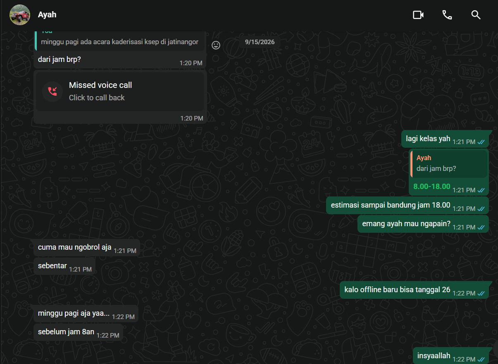

## Kompetensi target

Mengadaptasi repertoire dan language tanpa mengubah core meaning.

## Evidence wajib

- Lima versi untuk friend, technical peer, manager, customer, dan public.
- Alasan perubahan language dan repertoire.
- Feedback understanding dari sedikitnya satu target.

::: {.callout-tip title="Lihat contoh pengisian"}
[Buka contoh fiktif Minggu 4](../examples/week-04.qmd) untuk melihat tingkat kekonkretan evidence dan analisis. Jangan menyalin contoh sebagai evidence pribadi.
:::

## Core Meaning

**Fakta yang tidak boleh berubah:** Deadline lomba Pengembangan Perangkat Lunak GEMASTIK sisa 3 hari. Progress saat ini, UI/UX selesai dan 1 dari 3 bagian makalah selesai. Sisa pekerjaan, prototype software, prototype hardware, dan penyelesaian makalah full. Bantuan dan pembagian kerja tambahan diperlukan segera.

## Lima Versi Translation

| Target dan Character | Versi Language | Alasan Adaptasi |
|---|---|---|
| Friend | "Bro, deadline GEMASTIK tinggal 3 hari lagi. Kita baru beres UI/UX sama sepertiga makalah, prototipe software dan hardware plus sisa makalah belum kekejar. Bantu kebut bareng yuk, kita bagi shift biar kelar." | Ringkas, personal, dan mengajak kolaborasi dengan nada santai yang menjaga motivasi. Menekankan kebersamaan, bukan tekanan. |
| Technical peer | "Status GEMASTIK PPL, H-3 deadline. Done, UI/UX di Figma dan 1/3 makalah (bab 1). Todo, integrasi prototype software (REST API dan dashboard), wiring prototype hardware (sensor dan mikrokontroler), serta penulisan bab 2 dan 3. Butuh pair programming dan review skematik malam ini. Daftar task ada di Trello." | Menyebut deliverable teknis yang spesifik, stack, dan lokasi task. Mengurangi ambiguitas dan mempermudah pembagian kerja teknis. |
| Manager (Dosen pembimbing atau Ketua tim) | "Update GEMASTIK PPL per 23 September, H-3 deadline. Capaian 40 persen, UI/UX selesai dan 1/3 makalah terisi. Risiko, prototype software dan hardware serta 2/3 makalah belum selesai. Usulan, tambah jam kerja terfokus, bagi dua sub tim software dan hardware, serta review makalah harian jam 20.00. Keputusan yang dibutuhkan, persetujuan alokasi waktu lab dan feedback bab 1 hari ini." | Menekankan capaian, risiko, dampak, usulan aksi, dan decision point. Bahasa terstruktur untuk pengambilan keputusan cepat. |
| Customer (Panitia atau Pengguna yang menunggu deliverable) | "Tim kami sedang menyiapkan solusi untuk GEMASTIK dengan target kirim 3 hari lagi. Saat ini desain antarmuka telah selesai dan dokumen pendukung dalam proses. Prototype aplikasi dan perangkat masih dalam pengerjaan. Kami akan menginformasikan update berikutnya setelah prototype siap untuk uji coba." | Menjelaskan status dan ekspektasi tanpa jargon internal. Fokus pada transparansi dan kepastian tindak lanjut, bukan detail teknis. |
| Public (Pengumuman umum) | "Tim GEMASTIK Pengembangan Perangkat Lunak ITB sedang dalam tahap finalisasi. Deadline pengumpulan 3 hari lagi, progres desain selesai dan dokumen masih disusun. Prototype sedang dikerjakan. Mohon dukungan dan doanya agar pengumpulan dapat tepat waktu." | Konteks cukup untuk audiens luas, menjaga privacy detail internal dan menekankan progress serta kebutuhan dukungan moral. |

Core meaning tetap sama pada kelima versi, tanggal, sisa waktu, capaian, dan sisa pekerjaan tidak berubah. Yang berubah hanya repertoire dan tingkat detail sesuai kebutuhan person.

## Evidence Understanding

Saya menguji versi technical peer kepada satu rekan tim teknis tanpa menjelaskan konteks tambahan di luar tabel. Rekan menjawab bahwa ia memahami bahwa H-3 tersisa 60 persen pekerjaan dan perlu pair programming malam ini. Namun ia bertanya apakah prototype hardware sudah termasuk pengujian sensor atau hanya wiring awal.

Berdasarkan pertanyaan tersebut saya menambahkan klarifikasi pada versi technical peer, "wiring plus uji baca sensor awal di lab, belum kalibrasi penuh". Adaptasi ini memperjelas scope hardware tanpa mengubah core meaning dan mengurangi risiko salah ekspektasi.

Untuk versi customer, satu teman non teknis memahami bahwa tim masih mengerjakan prototype dan akan ada update setelah siap uji. Ia tidak menanyakan detail teknis, yang menandakan level detail sudah tepat untuk audiens tersebut.

## Analisis Komunikasi

| Elemen | Evidence dan Analisis |
|---|---|
| Person dan character | Lima person dibedakan berdasarkan pengetahuan dan kepentingannya. Friend butuh motivasi, technical peer butuh detail teknis, manager butuh overview risiko dan keputusan, customer butuh kepastian status, public butuh konteks umum. |
| Objective dan state | State awal, informasi deadline dan sisa pekerjaan belum tersampaikan dengan jelas ke tiap person. State tujuan, tiap person paham apa yang terjadi dan apa perannya. Objective tercapai ketika tiap versi dipahami sesuai kebutuhannya. |
| Repertoire dan language | Repertoire berubah dari ajakan personal, technical notice, decision brief, service update, hingga public announcement. Language menyesuaikan dari santai ke formal tanpa mengubah fakta deadline, capaian, dan sisa pekerjaan. |
| Response dan adaptation | Respons technical peer berupa pertanyaan tentang scope hardware menghasilkan adaptasi klarifikasi. Respons teman non teknis yang langsung paham menunjukkan versi customer sudah tepat. |
| Agreement dan action | Agreement, pembagian sub tim software dan hardware serta review makalah jam 20.00. Action, pair programming malam ini dan uji sensor awal di lab. Deadline tetap 3 hari sebagai batas aksi. |
| Relationship outcome | Relasi tim terjaga karena komunikasi jujur tentang progress dan risiko. Dengan manager terbangun kepercayaan karena transparansi capaian dan usulan solusi. Dengan public terjaga citra tim yang tetap profesional meski dalam tekanan deadline. |

## Evidence

::: {.evidence-block}
Progress board Trello dan file Figma UI/UX serta draft makalah 1/3 sebagai bukti capaian. Kontribusi saya adalah menyusun UI/UX, menulis 1/3 makalah, dan melayout pembagian sisa pekerjaan untuk prototype software dan hardware.

:::

## Penggunaan AI

Menggunakan Opencode untuk memeriksa konsistensi kelima versi. Prompt berisi core meaning dan instruksi untuk memastikan tanggal, sisa waktu 3 hari, capaian UI/UX dan 1/3 makalah, serta sisa prototype software, hardware, dan makalah full tetap ada di semua versi. Saya menolak saran AI yang menambahkan alasan "karena keterbatasan anggaran" karena tidak sesuai fakta. Pembelajaran yang tetap saya lakukan adalah memilih level detail yang tepat untuk tiap person tanpa distorsi makna.

## Feedback dan Tindak Lanjut

**Feedback yang diterima:** Rekan technical peer bertanya, "Hardware sudah termasuk uji sensor atau baru wiring?" Teman non teknis memberi feedback versi customer sudah jelas dan tidak membingungkan.

**Adaptation atau replay:** Saya menambahkan kalimat klarifikasi pada versi technical peer tentang uji baca sensor awal dan memperjelas bahwa kalibrasi belum penuh. Untuk versi lain tetap dipertahankan karena sudah dipahami.

**Next practice:** Pada pengumuman deadline berikutnya, saya akan selalu menyertakan tiga elemen, fakta, dampak, dan aksi yang diminta, serta menguji satu versi kepada perwakilan audiens sebelum disebar luas.

## Self-assessment

| Dimensi | Skor 1 sampai 4 | Evidence Singkat |
|---|---:|---|
| Person dan Character | 3 | Lima target dibedakan berdasarkan pengetahuan dan kebutuhan, bukan stereotipe, dengan language yang sesuai. |
| Objective dan State | 4 | Core meaning konsisten di semua versi, state awal dan tujuan translasi eksplisit dengan fakta yang tidak berubah. |
| Repertoire, Language dan AI | 4 | Lima repertoire dengan rationale yang jelas, AI digunakan untuk fact check dan ditolak jika menambah informasi yang tidak ada. |
| Response dan Adaptation | 3 | Pertanyaan rekan tentang scope hardware menghasilkan perbaikan klarifikasi yang spesifik. |
| Agreement, Action dan Relationship | 2 | Agreement pembagian sub tim dan review jam 20.00 sudah ada, namun belum ada bukti tanda tangan atau komitmen tertulis dari semua pihak. |

**Total: 16/20**

::: {.assessor-only}
### Assessment Dosen

**Skor:** - / 20  
**Evidence yang mendukung:** -  
**Prioritas perbaikan:** -  
**Keputusan:** Belum dinilai / Perlu revisi / Tercapai
:::
